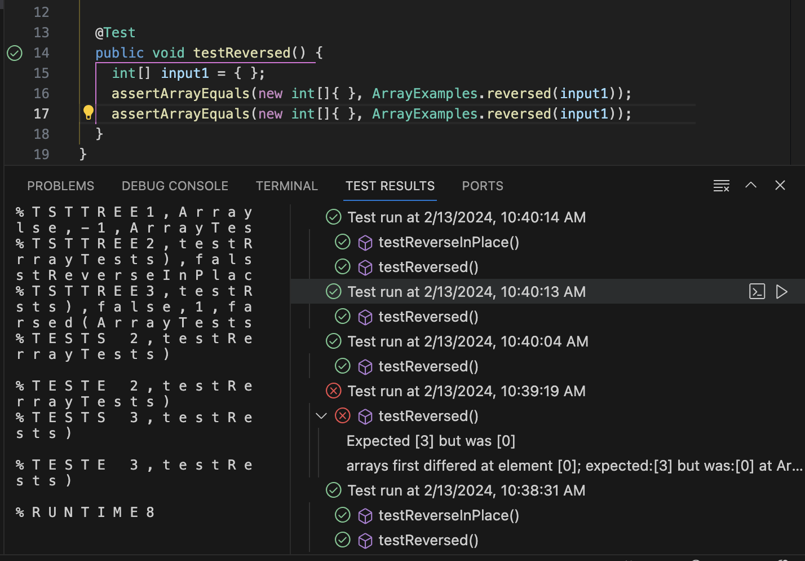
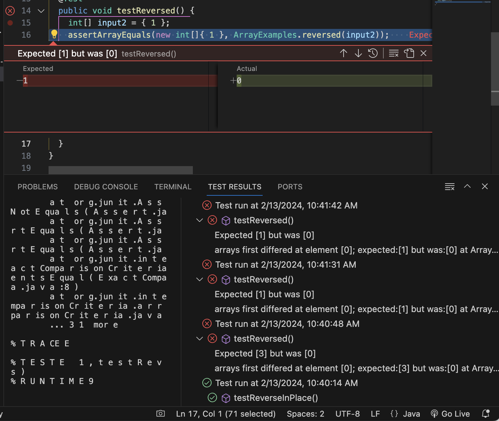

# week 5 lab report
## Part 1 - Bugs
One bug from week 4's lab: Array Methods
* A failure-inducing input
```
  @Test
  public void testReversed() {
    int[] input1 = { 1 };
    assertArrayEquals(new int[]{ 1 }, ArrayExamples.reversed(input1));
  }
```
* An input that doesn't induce a failure
```
  @Test
  public void testReversed() {
    int[] input1 = { };
    assertArrayEquals(new int[]{ }, ArrayExamples.reversed(input1));
  }
```
* Symptom
The output of an int array input will be an array filled with 0 with same length of input.





*Bug
Before fixing
```
  static int[] reversed(int[] arr) {
    int[] newArray = new int[arr.length];
    for(int i = 0; i < arr.length; i += 1) {
      arr[i] = newArray[arr.length - i - 1];
    }
    return arr;
  }
```
The `reversed` method creates a `newArray`. The length of `newArray` is same with `arr`. Java will assign the default value 0 to each element of the int array. The for loop assigns each element in `arr` to be the element in `newArray` from the backward direction. It makes the elements in `arr` to be the default value 0. 

After fixing 
```
  static int[] reversed(int[] arr) {
    int[] newArray = new int[arr.length];
    for(int i = 0; i < arr.length; i += 1) {
      newArray[i] = arr[arr.length - i - 1];
    }
    return newArray;
  }
```
In order to fix it, we need to assign each element in `newArray` to be the element in `arr` from the backward direction. Last, we return `newArray` which is the reversed version of `arr`.
## Part 2 - Researching Commands
* `find ./technical -name "*.txt"`


`-name` search for files and directories with a pattern.
